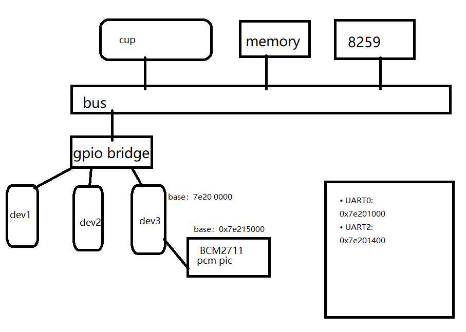
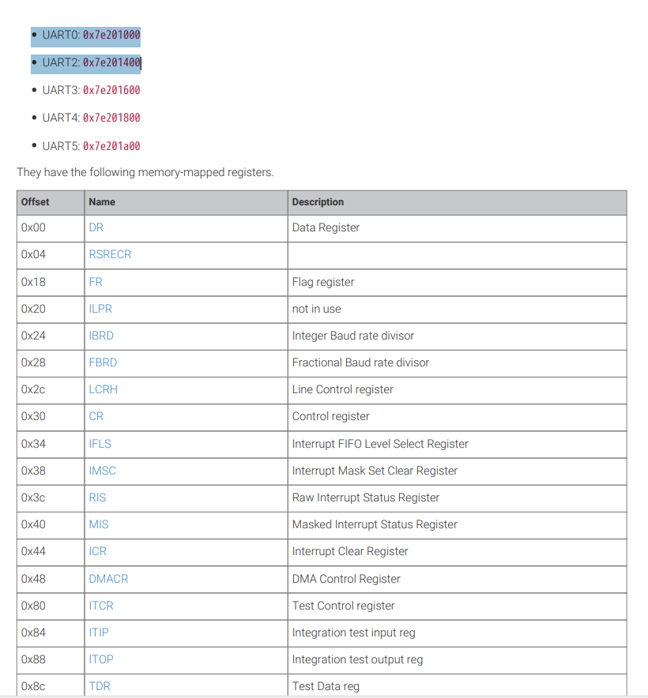

## 自我介绍
  彭泽辰，新能源大三学生，虽然现在专业是新能源，但是我一直在做有关计算机事情。以后也想从事计算机相关工作。  
  计算机溯源：  
中学：VBscript，VB（入门），python，php  
大学：c(kernel, 后端框架)、c++、c#、go（服务器）   
*此处只是用语言作为引入，个人认为语言是一个项目成功与否的最小因素*    
欢迎有志同道合的朋友加入开源项目！
## 实验进度和问题解决办法
  完成了第一阶段（5完成了前两个）和第二阶段的1、2。惭愧  
  环境搭建这部分文档比较全，第一次编译没注意qemu的版本，报了一些错  
  实验2、3基本没有什么问题，在qemu的build目录下拉仓库会节省很多时间，cv实验指导书即可完成  
  实验4、5我是先在qemu上跑了一次，做了5的前两个，板子回来后在板子上又跑了一遍  
  实验5的四个程序看似简单但是写的时候很吃力，当时也是gpt了几次，给的代码都不能用  
  开发板usb连接pc也有难度，一开始用linux尝试，因为这些概念完全没了解过最后还是用windows  
  putty连接的。解决问题主要靠请教队长和队员吧
  
  
## 感想建议
  实战阶段的实操比较多，实验文档比较详细。但是个人感觉rust的资料还是少之又少，印象比较  
深刻的是有一次百度Vec，出来的一半都是rust教程。然后gpt也不能给出有用的代码。其实阶段1的  
5的题目修改思路不复杂，但尴尬的是简单写不了-_-  
  建议第一阶段的语言讲解阶段可以重点讲后面用到的语法和相关内容，个人感觉rust这门语言  
  短时间很难掌握。
## 未来计划
  学习和理解相关的基本概念：uart，gpio等
  复习rust基本语法
  虽然这周和下周都是考试周，但是我会尽力往下做的。

最后感谢智能网联汽车的这次活动，感谢我的队长和队员们。接下来的时间大家共同努力！
  
